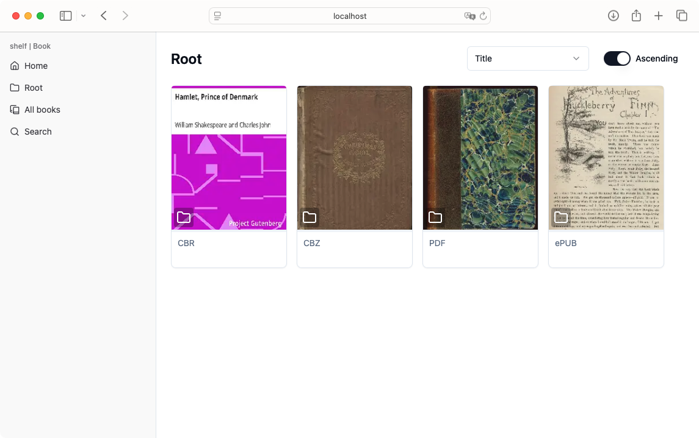
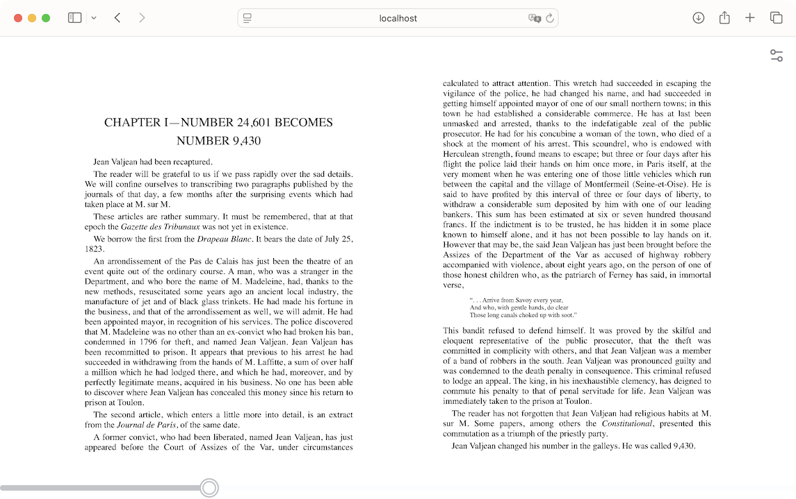
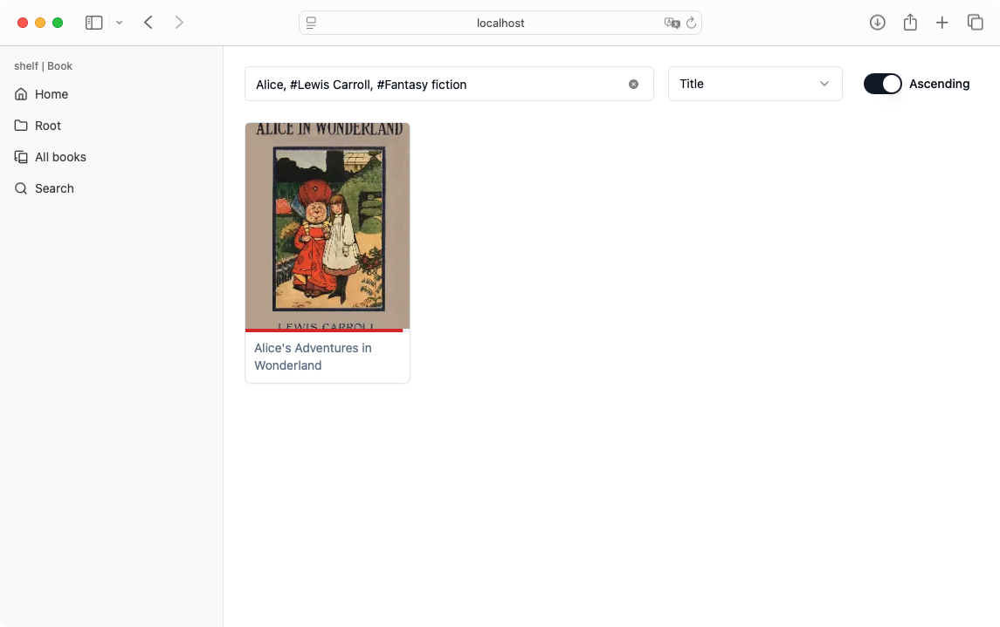

# shelf | Book

### A lightweight ebook server with an intuitive UI

<br>



### Supported Formats

| Format     | Viewer | Extract Cover | Extract Metadata |
|------------|--------|----------------|------------------|
| PDF        | ✅      | ✅             | ✅               |
| EPUB       | ✅      | ✅             | ✅               |
| CBZ        | ✅      | ✅             | ❌               |
| CBR        | ✅      | ✅             | ❌               |

✅ = Supported  △ = Partial Support / Experimental  ❌ = Not Supported

<details>
<summary><strong>Known Bugs</strong></summary>

- Safari: The epubViewer's display area may be reduced.  
- Safari: The epubViewer may become unresponsive.  

</details>

## Quickstart

```shell
git clone https://github.com/projects-shelf/Book.git
cd Book
docker-compose up -d
```

During the initial scan of the books, the server may appear unresponsive. Please wait until the process is finished.

## Features

### Simple viewer



options
  - LtoR / RtoL reading direction
  - No spreads / Odd spreads / Even spreads
  - Font size

### Searchable by title and metadata



Allows prefix search on titles and exact match search on metadata using hashtags (#).

### Lightweight

Built with Go and SQLite, it consumes minimal system resources.

```
CONTAINER ID   NAME               CPU %     MEM USAGE / LIMIT     MEM %     NET I/O         BLOCK I/O   PIDS
7b71d4d19569   shelf_book_go      0.00%     11.12MiB / 5.128GiB   0.21%     2MB / 242MB     0B / 0B     16
ec92381e644d   shelf_book_nginx   0.00%     2.031MiB / 5.128GiB   0.04%     244MB / 249MB   0B / 0B     2
```

Resource consumption during idle periods (on Intel Mac)

## License

Book is licensed under [MIT License](https://github.com/projects-shelf/Book/blob/main/LICENSE).

## Author

Developed by [PepperCat](https://github.com/PepperCat-YamanekoVillage).
